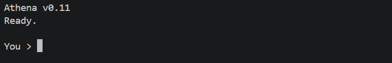

# Athena



**Athena is a local-first AI work assistant built in Python.**

Athena combines LLM reasoning with tools, persistent memory, experience retrieval, feedback, and permission-controlled actions.

The goal is simple:

> Help users complete useful work, not just answer questions.

## What Athena can do

- Answer questions, summarize, compare, and draft
- Read local documents
- Search the web
- Remember user-approved information
- Reuse relevant past experiences
- Adapt retrieval using user feedback
- Use tools through an explicit permission layer
- Support OpenRouter and Google Gemini
- Provide decision support while keeping the user in control

## Current release

**v0.11 — Work Assistant Foundations**

This release focuses on the foundations needed for a safe, extensible work assistant.

Athena currently supports reading, searching, summarizing, comparing, drafting, and decision support through a bounded five-step agent loop.

It also adds a Python-enforced permission boundary for tool execution.

Connected services such as Gmail, Google Drive, and Calendar are not implemented yet, and Athena does not run autonomous background tasks.

---

## Quick start

Athena requires **Python 3.10 or newer**.

Create a virtual environment:

```bash
python -m venv .venv
```

Activate it.

### Windows PowerShell

```powershell
.venv\Scripts\Activate.ps1
```

### macOS / Linux

```bash
source .venv/bin/activate
```

Install dependencies:

```bash
python -m pip install -r requirements.txt
```

Copy the example environment file:

```bash
cp .env.example .env
```

On Windows PowerShell:

```powershell
Copy-Item .env.example .env
```

Add your provider API key to `.env`.

Then run:

```bash
python agent.py
```

Example:

```text
Athena v0.11
Ready.

You > summarize the main points in report.md

Athena > ...
```

OpenRouter and Gemini are currently supported.

Keep `.env` private. Runtime memory and experience files are created locally and are excluded from Git.

---

## Configuration

Example `.env`:

```env
MODEL_PROVIDER=openrouter
MODEL_NAME=openrouter/free
MY_AGENT_DEBUG=false

OPENROUTER_API_KEY=
GEMINI_API_KEY=
TAVILY_API_KEY=
```

For Gemini:

```env
MODEL_PROVIDER=gemini
MODEL_NAME=gemini-3.1-flash-lite
```

`MY_AGENT_DEBUG=true` enables development diagnostics.

The `MY_AGENT_DEBUG` name is retained for backward compatibility.

---

## Commands

Athena includes a small CLI command set:

| Command | Purpose |
| --- | --- |
| `/tools` | Show available tools, permissions, and approval requirements |
| `/status` | Show version, provider, model, debug status, and enabled systems |
| `/history` | Show recent conversation history |
| `/clear` | Clear the current conversation and feedback target |
| `/good` | Mark the latest eligible experience as user-validated |
| `/bad` | Mark it as user-rejected |
| `/neutral` | Return it to unverified quality |
| `/help` | Show available commands |
| `exit` | Exit Athena |

Normal output stays quiet except for answers, commands, and required approval prompts.

---

## Tools and permissions

Athena separates **model decisions** from **execution authority**.

The LLM may request a tool, but Python validates permissions before the tool executes.

| Category | Use | Confirmation |
| --- | --- | --- |
| `READ_ONLY` | Local reads, time, memory search | Normally none |
| `WRITE_LOCAL` | Local modifications such as saving memory | Required |
| `EXTERNAL_READ` | Web search and future connected reads | Normally none |
| `EXTERNAL_WRITE` | Future external modifications | Required |
| `SENSITIVE_ACTION` | Future sensitive operations | Required |

Write-capable actions cannot disable confirmation.

Unknown permission values fail closed.

A read tool may also explicitly require confirmation if needed.

---

## Confirmation model

Actions that modify state require explicit approval.

For example:

```text
You > Remember that I prefer short reports

Proposed action: save_memory
Save information when the user explicitly asks to remember it.
Arguments: {"text": "I prefer short reports"}
Approve? [y/N]
```

Only an explicit `y` or `yes` authorizes the action in the CLI.

Pressing Enter, answering no, reaching EOF, or interrupting the prompt rejects the action.

The model cannot approve its own action.

Model-provided approval fields are ignored or rejected.

Each action requires its own approval decision.

---

## Tool architecture

Athena uses a typed registry for tool metadata.

Each tool can define:

- name
- description
- argument schema
- permission category
- confirmation requirement
- handler

The registry is used by both the model-facing system prompt and the `/tools` command.

The tool implementation is split into modules under:

```text
tool_modules/
├── confirmation.py
├── local_files.py
├── memory.py
├── registry.py
├── results.py
├── safety.py
└── web.py
```

`tools.py` remains the compatibility facade so existing imports continue to work.

---

## Document reading

Athena currently supports:

- `.txt`
- `.md`
- `.json`
- `.csv`

through:

```python
read_document(path, offset=0, max_chars=12000)
```

Supported files must:

- remain inside the configured workspace
- be no larger than 100 KiB
- contain valid UTF-8 text
- pass path and credential safety checks

The reader blocks:

- path traversal
- files outside the workspace
- symbolic links
- hard-linked files
- excluded directories
- known credential filenames
- private-key material
- invalid UTF-8
- binary control bytes

Secrets are redacted before text is returned to the model.

Large supported files are read in bounded chunks using continuation offsets.

Athena does **not** currently support:

- PDF
- DOCX
- OCR
- spreadsheet editing
- unrestricted file writing

These are intentionally deferred until format-specific limits and parsers are added safely.

---

## Memory

Athena has persistent local memory.

Memory is stored in `memory.json` and survives restarts.

The assistant is instructed to save information only when the user explicitly asks it to remember something.

Model-selected memory writes require confirmation.

Example:

```text
You > Remember that I prefer concise technical reports.
```

Athena proposes the memory write and asks for approval before storing it.

---

## Experience system

Athena automatically records compact metadata about completed tasks.

Experience records can include:

- task
- provider and model
- steps used
- tools used
- outcome
- feedback
- quality state
- error category
- lesson placeholders for future versions

The current system distinguishes:

```text
completed but unverified
user validated
user rejected
execution failed
```

A completed response is **not automatically considered correct**.

Past experiences are treated as evidence, not truth.

---

## Experience retrieval

Before a new task, Athena may retrieve up to three relevant past experiences.

Retrieval currently uses deterministic lexical similarity with:

- weighted token overlap
- relevance thresholds
- duplicate suppression
- quality adjustments
- feedback adjustments
- execution outcome
- recency as a tie-breaker

Rejected or failed experiences may still be retrieved as cautionary evidence.

Historical final answers and raw tool outputs are not automatically replayed into the model context.

See [EXPERIENCE.md](EXPERIENCE.md) for the detailed experience and storage design.

---

## Feedback

After a task, the user can rate the latest eligible experience:

```text
/good
/bad
/neutral
```

Feedback replaces the previous rating rather than accumulating.

Feedback affects future experience ranking and quality state.

This is **not model training or reinforcement learning**.

Athena adapts through external memory and experience retrieval around the base LLM.

---

## Storage safety

Local JSON stores use safer persistence behavior, including:

- atomic writes
- previous-generation backups
- corruption preservation/quarantine
- recovery from valid backups when available

Runtime files are excluded from Git.

Concurrent writers are not currently supported.

---

## Web search

Athena supports web search through Tavily.

A Tavily API key is optional unless web search is needed.

Web search is classified as:

```text
EXTERNAL_READ
```

and normally does not require confirmation.

---

## Providers

Athena currently supports:

- OpenRouter
- Google Gemini

The provider is selected through `.env`.

The project is intentionally provider-agnostic so additional providers, including local models, can be added later.

---

## Decision support

Athena is designed to help with decisions, not silently make them on the user's behalf.

It should:

- distinguish facts from analysis
- explain important tradeoffs
- show the basis for recommendations
- avoid presenting subjective judgments as objective facts
- keep final authority with the user

Example:

```text
You > Which proposal is better?

Athena >
Proposal A has the lower cost.
Proposal B has stronger warranty coverage.

If minimizing upfront cost is the priority, A aligns better.
If long-term support is the priority, B aligns better.
```

---

## Drafting versus execution

Athena treats these as separate concepts:

```text
drafting something
≠
executing or sending it
```

For future connected services:

```text
draft email
```

must remain separate from:

```text
send email
```

Likewise:

```text
prepare calendar event
```

must remain separate from:

```text
create calendar event
```

Actions that affect external systems will require explicit permission.

---

## Planned direction

Athena is evolving toward a practical AI work assistant.

Planned areas include:

- Gmail read/search
- Google Drive read/search
- Google Calendar integration
- PDF and DOCX reading
- local LLM support
- semantic experience retrieval
- reusable lessons
- richer document workflows
- permission-controlled external actions

The goal is to let users give Athena **work**, not just questions.

---

## Example workflows

### Read-only

```text
You > List the workspace files.
```

Athena selects `list_files`, Python validates the request, and the tool executes without approval.

### Local document summary

```text
You > Read report.md and summarize the risks.
```

Athena uses `read_document`, reads the document in bounded chunks if needed, and summarizes the result.

### Memory write

```text
You > Remember that I prefer short reports.
```

Athena proposes `save_memory`, shows the sanitized action, and executes only after approval.

---

## Tests

The test suite is offline and uses isolated stores and fake providers.

Install development dependencies:

```bash
python -m pip install ".[dev]"
```

Run the full suite:

```bash
python -m pytest -q
```

Tests cover:

- providers
- model errors
- CLI behavior
- quiet/debug output
- persistent memory
- conversation history
- experience recording
- experience retrieval
- feedback
- JSON storage recovery
- web search behavior
- tool permissions
- approval and rejection
- model bypass attempts
- document reading
- safe previews
- assistant workflows

The tests verify deterministic implementation behavior.

They do not independently measure live-model answer quality.

---

## License

Athena is licensed under the **Apache License 2.0**.

See [LICENSE](LICENSE).

---

## Project status

Athena is under active development.

**Current release: v0.11 — Work Assistant Foundations**

The current focus is building a safe and useful foundation before adding connected workplace services and external actions.
